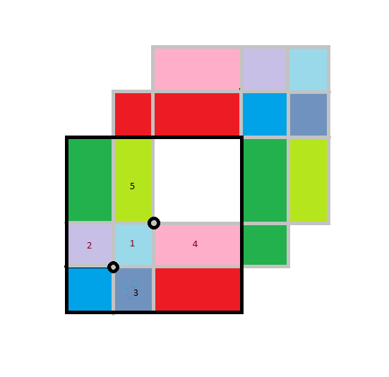

# Clipmap

Toroidal Update

offset (in clip level space)

newOffset (in clip level space)

diff = newOffset - offset (by texels, in both textures space and clip level space)

clipCenter (in texture space)

newClipCenter (in texture space)

clipSize (by texels, in both textures space and clip level space)

halfSize (by texels, in both textures space and clip level space)

clipToTex = clipcenter - halfSize + offset (by texels, in both textures space and clip level space)

## updated zones

newClipCenter may be outside 

unity ok with copying 0 area

### Zone 1

    Dst (in clipLevel space)
        +X+Y 
            min: offset.x + offset.y
            max: newOffset.x + newOffset.Y
        +X-Y 
            min: offset.x + newOffset.y
            max: newOffset.x + offset.y
        -X+Y 
            min: newOffset.x, offset.y
            max: offset.x + newoffset.y
        -X-Y 
            min: newOffset.x + newOffset.y
            max: offset.x + offset.y
            
    Src (in texture space)
        +X+Y 
            min: clipCenter + halfSize + offset.x + offset.y
            max: clipCenter + halfSize + newOffset.x + newOffset.y
        +X-Y 
            min: clipCenter - halfSize.x - halfSize.y - offset.y
            max: 
        -X+Y 
            min: 
            max: 
        -X-Y 
            min: 
            max: 
    
### Zone 1
        Src (in texture space)
            +X+Y min: clipCenter.xy + halfsize.xy + offset.y
            +X+Y max: clipCenter.xy + halfsize.xy + offset.xy + diff.y

        Dst (in clipLevel space)
            min: offset.y
            max: offset.xy + newoffset.y

